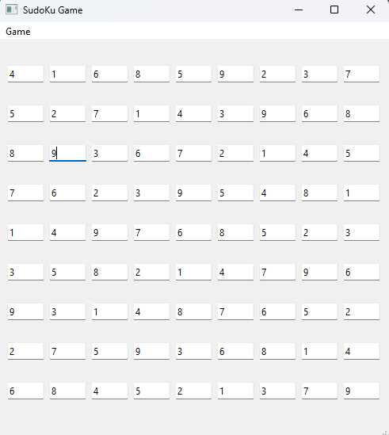

# Sudoku

Sudoku, popular form of number game. In its simplest and most common configuration, sudoku consists of a 9 × 9 grid with numbers appearing in some of the squares. The object of the puzzle is to fill the remaining squares, using all the numbers 1–9 exactly once in each row, column, and the nine 3 × 3 subgrids. Sudoku is based entirely on logic, without any arithmetic involved, and the level of difficulty is determined by the quantity and positions of the original numbers.

I used [jeffsieu/py-sudoku](https://github.com/jeffsieu/py-sudoku) library to make sudoku numbers. 

##

## To Do
- [x] Python
- [ ] C